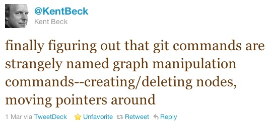

!SLIDE bullets incremental
## Remember the  Takeaway Message?

* **Most of Git's power comes from   the way it looks at the world.**
* **Once you understand Git's perspective,   it gets much easier to use.**

!SLIDE center

!SLIDE center bullets incremental

* (This one's still a joke, though.)
* (I hope...)

!SLIDE center
### Look familiar?

Git merge heck

!SLIDE bullets incremental
## A Git repository is a graph.
<ul>
  <li>Every Git commit is a node.</li>
  <li>Nodes can point to other nodes  that came before them.</li>
  <li>Most commits point to one parent commit.</li>
  <li>Merge commits point to two   (or more!) parent commits.</li>
</ul>

!SLIDE center
In ["Git for Ages 4 And Up"](http://2010.osdc.com.au/proposal/196/git-ages-4-and), Michael Schwern uses 
Tinker Toys to teach how Git works.

 
From the session description *(emphasis added)*:

> ***Git makes so much more sense when you understand how it really works,*** because it's really a two trick pony.
>    
> Tinker Toys are the best illustration of a Git repository I've found. Side-by-side with issuing Git commands, we'll build a Git repository out of kid's toys showing what's going on behind the scenes. Mind bending concepts like remote branching, rebase and the staging area become child's play.
>    
> WARNING: CHOKING HAZARD - Small Parts. Not For Children Under 4 Years.

 (Really, you should just go watch that video.  It's brilliant.)

[http://osdc.blip.tv/file/4441963](http://osdc.blip.tv/file/4441963)

!SLIDE smbullets incremental
## Tinker Toy TL;DR

* Most Git operations do one of two things:
  &nbsp;
* **Build commits** (nodes in the graph).
* (Git does this as soon as you stage files   using "git add" or equivalent.)
  &nbsp;
* **Move labels** from one node to another.
* (When you type "git commit", you're just moving the label for that branch to the node Git created when you typed "git add".)

!SLIDE smbullets incremental
## Whaddaya mean, "move labels"?
* 
* GitX uses four colors for labels:
* **Orange** indicates the current local branch (if any).
* **Green** indicates another local branch.
* **Blue** indicates a remote branch.
* **Yellow** indicates a tag (or, curiously, a stash).

!SLIDE smbullets incremental
## Each of these labels is what Git *helpfully* calls a "reference".
* **Local branch** references move when you type certain commands:
    * **git commit**
    * **git merge**
    * **git rebase**
    * **git reset**
    * (in fact, moving local branch refs is exactly what <code>git reset</code> is for!)
* **Remote branch** references move when you fetch from (or push to) their repository.
* **Tag** references don't move at all.
    * (That, after all, is the ***entire point*** of a tag.)

!SLIDE smbullets incremental center
## More graph theory!

### Assuming this is a directed graph   (all arrows from RIGHT to LEFT):

* Which nodes can you reach starting from H?
* From E?
* From K?

!SLIDE smbullets incremental center
## References make commits reachable.

* No, really, read that again.
* **References**...
    * (aka labels)
    * (aka branches or tags)
* make **commits**...
    * (aka nodes)
* **reachable**.
    * (meaning you can see them in GitX)

!SLIDE bullets incremental
## ...and?

* When I first started using Git, I was really paranoid about losing code.
* So, before I tried something tricky,  I would back up ***the entire directory.***

!SLIDE commandline

	$ cd ..
	$ cp -r work backup
	$ cd work
	#do something tricky
	#confirm that it worked
	$ cd ..
	$ rm -rf backup
	$ cd work
	#move on to the next thing

!SLIDE bullets incremental
## Until I realized...

* I was always working on a branch.
* Branches are references.
* And (say it with me now)...
* **References make commits reachable.**

!SLIDE smbullets incremental
## Working With a Smaller Net
* So if I created a new branch...
* and did a weird merge on ***that*** branch...

* **If I fubared it**,
* I could always just switch back to the original branch.
* **If I got it right**,
* I could merge the original branch to the new one.
* *(Later, I realized I could use 'git reset' instead of merging.)*

!SLIDE smbullets incremental
## Experimenting with Git

This leads to my final bit of canned advice for experimenting with Git.

* BEFORE YOU DO SOMETHING TRICKY:
<!-- *  -->
* Use a branch (or tag) like you would a saved game.
* Look at GitX and understand where you are now.
* Take a deep breath...

!SLIDE smbullets incremental
## The Last Slide
### Hallelujah!

* Ready? Okay. Go do something tricky.
* Switch back to GitX.
* **Before you refresh GitX:**
* Predict what it should look like after the tricky thing you just did.
    * (Draw it on an index card if that helps.)
* Refresh GitX (Cmd+R).
* Confirm (or disprove) your prediction.

!SLIDE center
## STOP
### Demotime!

