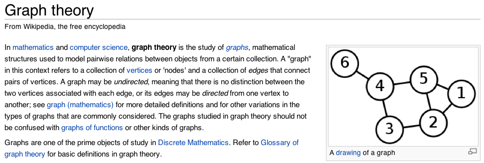

!SLIDE bullets incremental
## These have:
* 1) Places to be, and
* 2) Ways to get between them.
* #### That's... 

!SLIDE center
## Graph Theory! 

!SLIDE center

"And all I heard was **'nerd, nerd, nerd.'**"

-AndyBean

!SLIDE smbullets incremental
## From the Wikipedia page:

(lightly edited)

* <blockquote>A **graph** refers to a collection of **nodes** and a collection of **edges** that connect pairs of nodes.</blockquote>
* 1) **Nodes**: places to be
* 2) **Edges**: ways to get between them

!SLIDE center
### This all started in 1735.

The city of Königsberg, in what was then Prussia, was set on both sides of a river.  Seven bridges linked both sides of the river and two large islands.

 

In 1735, Leonhard Euler (famous among mathematicians) posed this problem:

Find a walk through the city that would cross each bridge once <strong>and only once</strong>.

(SPOILER:  it can't be done.  I'll spare you the math.)

!SLIDE center smbullets incremental
## Dude. I thought this was   supposed to be about Git?
* Trust me.
* Remember this?
*  
