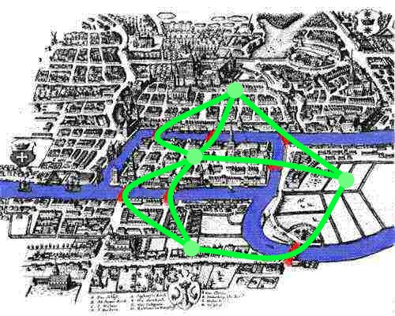
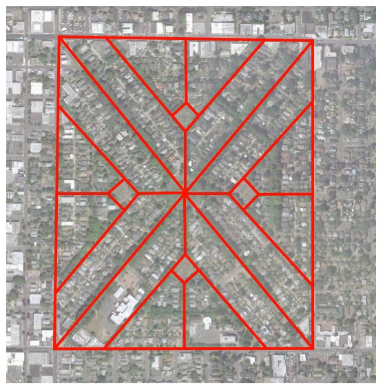
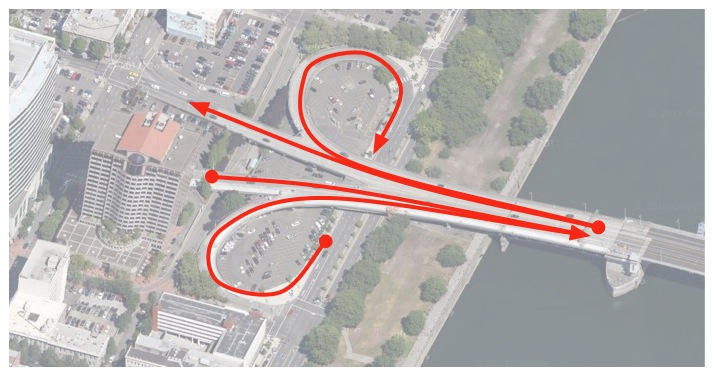
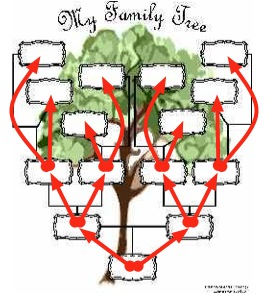
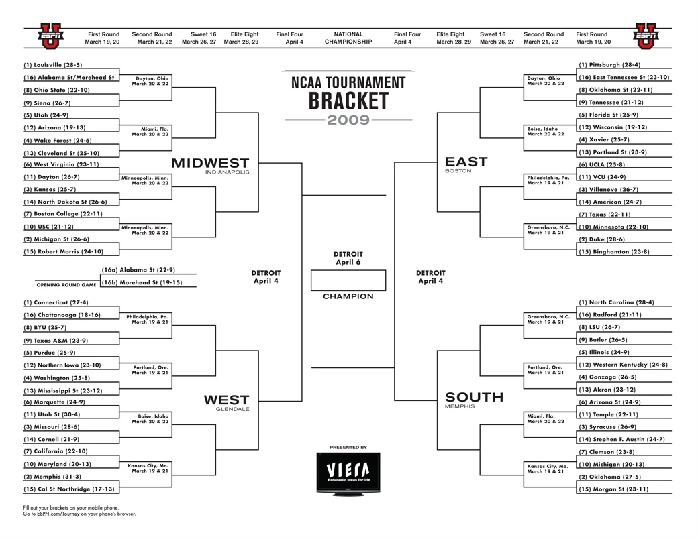
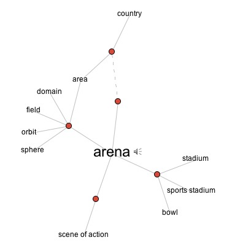
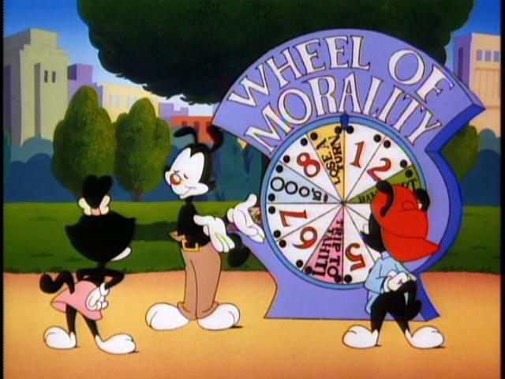

!SLIDE center smbullets
## Let's look at those examples   one more time   (but in a different order)

(These examples have a lot packed into them. It's not important that you remember all of the terms.)
 

* 1) **Nodes**: places to be
* 2) **Edges**: ways to get between them

!SLIDE center
### 18th-Century Königsberg, Prussia

**Nodes** = land masses

**Edges** = bridges

 For the purposes of his problem (crossing each bridge exactly once),

Euler condensed an entire land mass down to one point.

 Where you go while you're on an island doesn't matter...

if you're only concerned about which bridges you cross.

!SLIDE center
### The World (According to Facebook)
 

 
**Nodes** = cities with Facebook users

**Edges** = "Friend of" links between (lots of) people in those cities

 
Graphs can be quite **large**.

!SLIDE center
### Ladd's Addition

**Nodes** = intersections

**Edges** = streets

 I've drawn these streets as two-way.  (In reality, some are one-way.)

Graph theory calls two-way edges **undirected edges**

(and graphs with them are **undirected graphs**).

!SLIDE center
### Morrison Bridge

**Nodes** = intersections (ish)

**Edges** = streets

 
Note that these edges are one-way.

Graph theory calls them **directed edges**

(and graphs with them are **directed graphs**).

 
We often say that a directed edge

(or, if we're being sloppy, the node it starts at)

"points to" another node.

!SLIDE center
### Social Networks

**Nodes** = people

**Edges** = some kind of social tie (see labels)

 
I included this one to show another useful feature of graphs:

**We can attach information to nodes and edges.**

 
A more realistic social graph might be **directed**.

(For example, you might want to model the "has a crush on" relationship.)

!SLIDE center
### Family Tree (Ancestors)

**Nodes** = family members

**Edges** = "parent is" relationship

 
This kind of graph is called a **tree**.

(Trees show up everywhere in computer science.)

 
Running with the tree metaphor, the node at the "bottom" is called the **root node**. 
(But sometimes it's drawn at the top.)

 
Subsections of the tree are called **branches**. (Where have I heard that before?)

 
Nodes that don't point to any other nodes are called **leaf nodes**.

!SLIDE center
### Some Sort of Sporting Event

It's not displayed the same way as the family tree, but it has the same properties.

!SLIDE center
### VisualThesaurus.com

By now, there's not much to say about this.

I mostly included it to define the "mathy" end of the continuum.

 The site is fun to play with, too.

!SLIDE center
## What's the Point?

"Wheel of Morality, turn, turn, turn. Tell us the lesson that we should learn."

-The Animaniacs

!SLIDE smbullets incremental
## What's the Point?
* For me, learning about graphs was like taking psychedelics:   it changed the way I looked at the world.
*    (This slide probably says *way* more about me than you wanted to know.)
* Once I learned about graph theory, I started seeing graphs everywhere, and I wanted to share that experience with you.

