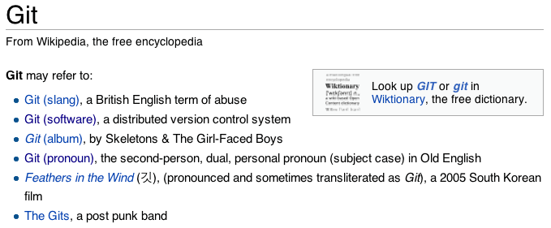
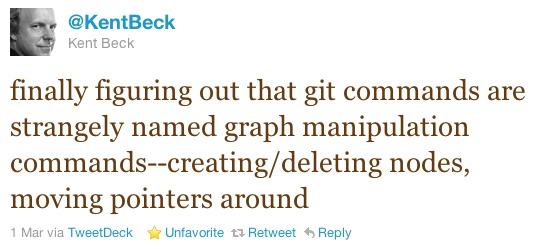
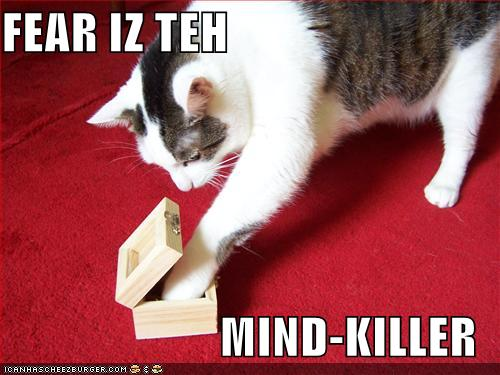

!SLIDE center
# Think Like (a) Git!

### <a href="http://resume.livingston-gray.com">Sam Livingston-Gray</a>
#### geeksam at: { <a href="https://github.com/geeksam/">Github</a>, <a href="https://twitter.com/#!/geeksam">Twitter</a>, <a href="mailto:geeksam@gmail.com">Gmail</a> }

!SLIDE bullets incremental
## Git is famously difficult to learn.
* Once people achieve some level of  Git enlightenment, they tend to say things like  "Git makes more sense when you understand X."
* 
* But that doesn't do much to help people staring up that learning curve. 

!SLIDE center
### Git makes more sense when you understand X   (Part 1)

!SLIDE center smbullets incremental
### Git makes more sense when you understand X   (Part 2)

* (Don't worry.  It's a joke.)
* (At least, I hope it is...)

!SLIDE smbullets incremental center
## Don't Fear The Git
* My goal is to reduce your fear of Git...
* 
* so you can increase your Git fu.

!SLIDE bullets incremental
## Takeaway Message
* Git is obscure, but very very powerful.
* Most of Git's power comes from   the way it looks at the world.
* That perspective can be taught.
* Once you understand Git's perspective,   it gets much easier to use.

!SLIDE bullets incremental
## Git is obscure, but very very powerful.

<ul>
  <li>
    <blockquote style="font-size: 50%;">
      "And then there’s <code>git rebase --interactive</code>, which is a bit like   <code>git commit --amend</code> hopped up on acid and holding a chainsaw–completely insane and quite dangerous but capable of exposing entirely new states of mind."
        
      -Ryan Tomayko, <a href="http://tomayko.com/writings/the-thing-about-git">The Thing About Git</a>, April 2008
    </blockquote>
  </li>
</ul>

!SLIDE bullets incremental
## Git's power comes from   the way it looks at the world.
* (Actually, it comes from the way   *computer scientists* see the world.)

!SLIDE bullets incremental
## That perspective can be taught.
* (It's surprisingly easy to learn.)

!SLIDE bullets incremental
## Once you understand   Git's perspective, it gets much   easier to use.
* (Look, a haiku!)

